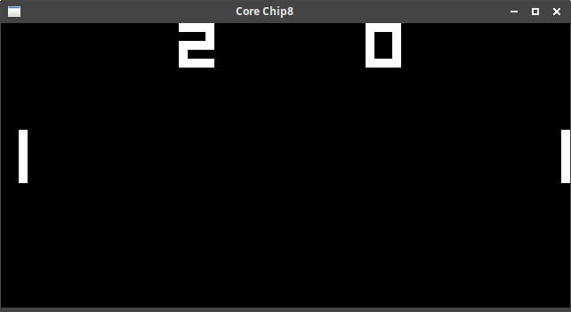
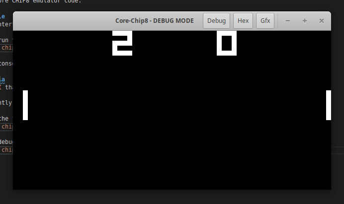
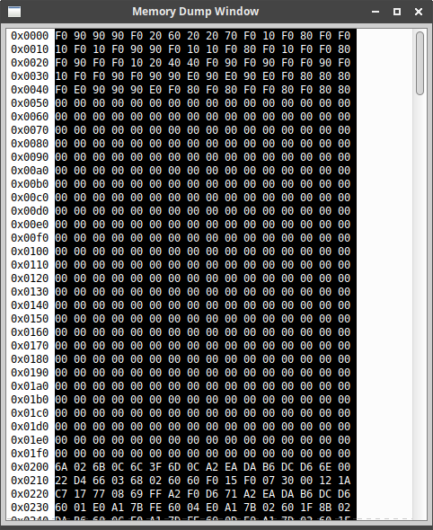
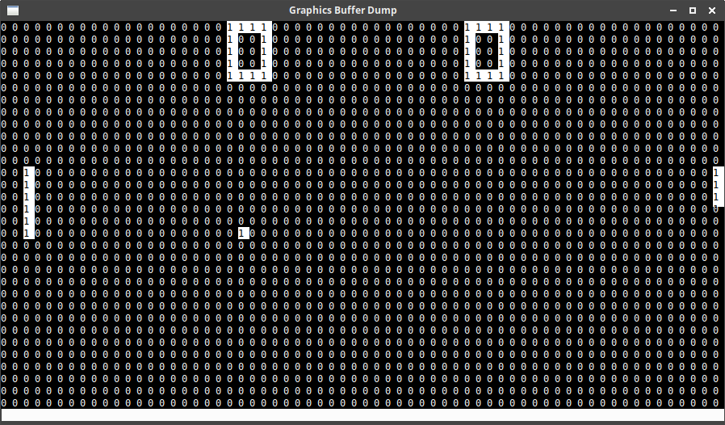
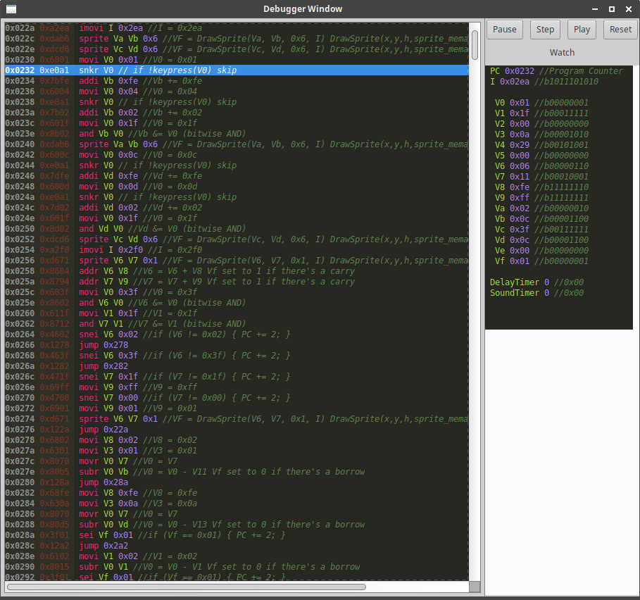

# Core CHIP-8
by Dale Nunns - https://xor.co.za

_//TODO: This is still very much a work in progress_

CHIP-8 Emulator written in .NET Core 2.2 - built as an exercise to learn the .NET Core tooling and how emulators work.  
Mostly built based on the info on the CHIP-8 Wikipedia page (https://en.wikipedia.org/wiki/CHIP-8)

0-9 on the numeric keybpad as input to the game. (Note that A-F is not currently implemented.)

You'll need the dotnet tooling and then run `dotnet restore` to restore all of the dependencies. 

## chip8.core 
Contains the core CHIP8 emulator code.

## chip8.roms
Contains some test ROMS, not all of the ROM images in the zip files will work on this emulator.

## chip8.console
Console UI / Interface that makes use of the CHIP8 Emulator Core.

To launch and run the console version of the emulator you can run it with the following command. 
`dotnet run -p chip8.console chip8.roms/PONG` 

Note that the console interface is a little buggy and keypresses don't quiet work.

## chip8.gtkskia
GTK# + Skia# UI that makes use of the CHIP8 Emulator Core. 

This has currently only been tested on Ubuntu Linux, should work on Windows assuming GTK is available.

To launch run the following command.
`dotnet run -p chip8.gtkskia chip8.roms/PONG`

### Enabling the Debugger

To launch the debug mode use the following command.
`dotnet run -p chip8.gtkskia -debug chip8.roms/PONG`

#### Memory hex dump (Hex button)

#### Graphics Buffer Dump (Gfx button)

#### Debugger (Debug button)

`Pause` will pause the emulation.  
`Step` will step one instruction forward.  
`Play` will continue running the emulation.  
`Reset` resets the emulation.  

